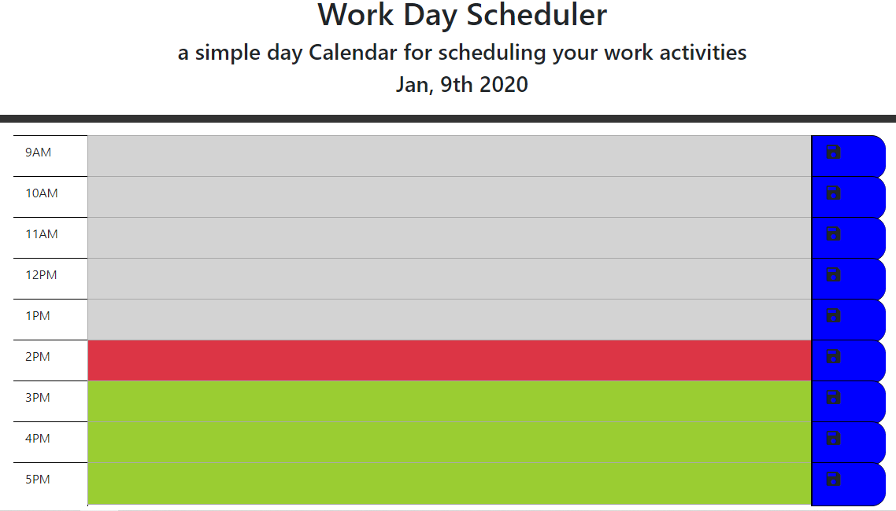

# Nine to five scheduler
You can schedule things from 9 to 5. The present, past and current time blocks are color coded. The result is stored in local storage. Bootstraps form groups made designing this a lot easier. Fontawesome had a nice save icon.

# Repo:
https://github.com/ScottMikul/ninetofiveapp

# Static page demo: 
https://scottmikul.github.io/ninetofiveapp/

## License
This project is licensed under the MIT License - see the [LICENSE.md](LICENSE.md) file for details

